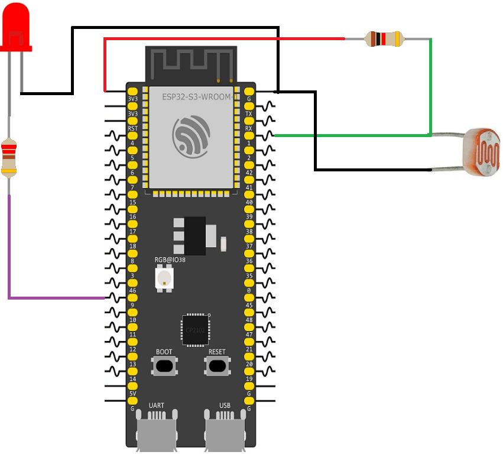

## Objectives
- Exploring Real-Time Operating Systems (RTOS)
- Understanding FreeRTOS Tasks and Scheduling
- Managing Inter-Task Communication with Queues
- Protecting Shared Resources with Mutexes and Semaphores
## Real-Time Operating Systems (RTOS)
When building simple embedded projects, we usually write our code inside a single infinite loop, often called a "Super Loop" or "Bare-Metal" programming. In this approach, the microcontroller executes one instruction after another. If a specific function takes a long time to complete or if we use a blocking function the entire processor stops, and no other code can run until that function finishes.   
As embedded systems become more complex, combining Wi-Fi, sensor reading, display updates, and user input, the Super Loop approach falls apart. The system becomes unresponsive and difficult to manage.  
To overcome this limitation, a Real-Time Operating System (RTOS) is used. An RTOS acts as a highly efficient manager for the microcontroller. Instead of one massive loop, we break our program down into smaller, independent mini-programs called Tasks. The RTOS rapidly switches the processor's attention between these tasks based on timing and priority. This rapid switching creates the illusion that multiple tasks are running simultaneously, making the system highly responsive and deterministic.
### FreeRTOS and the ESP32-S3
The ESP-IDF framework uses FreeRTOS as its core operating system. FreeRTOS is the industry standard for embedded systems. However, standard FreeRTOS is designed for single-core processors. Because the ESP32-S3 has a dual-core processor, Espressif heavily modified FreeRTOS to support SMP (Symmetric Multiprocessing).

This means the ESP-IDF version of FreeRTOS allows us to not only split our program into tasks but also explicitly dictate whether a task runs on Core 0 usually reserved for Wi-Fi/Bluetooth protocols or Core 1 usually reserved for application code.
### Scheduler Behavior
At the center of FreeRTOS lies the scheduler, the component responsible for deciding which task gets access to the CPU at any given moment. The scheduler operates using a periodic signal known as the tick interrupt. A hardware timer inside the microcontroller generates this interrupt at a fixed frequency commonly every 1 millisecond (1 kHz) in ESP-IDF systems. Each time this interrupt occurs, FreeRTOS briefly pauses normal execution and reevaluates the state of all tasks in the system.

This periodic reevaluation is what gives FreeRTOS its “real-time” behavior. Instead of allowing a single program flow to run endlessly, the operating system constantly checks whether another task should take control of the processor. Tasks can be in different states such as _Running_, _Ready_, _Blocked_, or _Suspended_. The scheduler’s job is to examine these states and choose the highest-priority task that is ready to execute.

FreeRTOS uses a preemptive scheduling model, which means that task priority directly influences CPU access. If a higher-priority task becomes ready while a lower-priority task is currently running, the scheduler immediately interrupts the lower-priority task and switches execution to the higher-priority one. This process is called preemption. 

The scheduler also manages situations where multiple tasks share the same priority level. In this case, FreeRTOS typically uses a technique called **time slicing**. Rather than allowing one task to monopolize the CPU, the scheduler divides processor time into small slices based on the system tick. One task may run for a single tick, after which another task of equal priority gets a turn. This alternating pattern continues as long as both tasks remain ready to run. 

An important detail is that context switching the act of stopping one task and starting another happens very quickly. FreeRTOS saves the current task’s execution context, including CPU registers and stack information, before restoring the context of the next task. Because this process is lightweight, the operating system can switch between tasks rapidly enough that multitasking appears simultaneous, even on a single-core processor.
### Tasks
A task is the most fundamental building block of FreeRTOS. We can think of a task as an independent program with its own infinite loop, its own priority, and its own allocated memory (called a stack).

Tasks in FreeRTOS operate in different states
- **Running:** The task is currently executing on the CPU core.
- **Ready:** The task is ready to run but is waiting because a higher-priority task is currently using the CPU.
- **Blocked:** The task is waiting for something to happen (like a timer to expire, or waiting for data from a sensor). While blocked, it consumes **zero** CPU time.
- **Suspended:** The task is explicitly paused by the programmer and will not run again until explicitly resumed.
#### Task Priorities
Every task is assigned a priority from `0` to `configMAX_PRIORITIES - 1` in ESP-IDF, the max is usually 24. Higher numbers represent higher priority. The FreeRTOS scheduler strictly obeys priority: it will always pause a lower-priority task if a higher-priority task is Ready to run.
#### Programming Tasks in ESP-IDF
Let’s build a simple project to demonstrate tasks. We want to blink two LEDs at completely different frequencies. We can do it using a super loop with delays, and it works, but this approach produces blocking code. If the frequencies are unrelated, we may run into problems. With FreeRTOS, we can assign each LED its own individual task.

First, we define our task functions. Every task in FreeRTOS must return `void`, take a `void *` parameter, and contain an infinite loop. Crucially, we must use `vTaskDelay()` instead of a standard delay. `vTaskDelay()` puts the task into the **Blocked** state, freeing up the CPU core to run other tasks.
```c
#include "freertos/FreeRTOS.h"
#include "freertos/task.h"
#include "driver/gpio.h"

#define LED_1 4
#define LED_2 5

// Task 1: Blinks LED 1 every 500ms
void blink_task_1(void *pvParameters) {
    gpio_set_direction(LED_1, GPIO_MODE_OUTPUT);
    
    while (1) {
        gpio_set_level(LED_1, 1);
        vTaskDelay(pdMS_TO_TICKS(500)); // Block for 500ms
        gpio_set_level(LED_1, 0);
        vTaskDelay(pdMS_TO_TICKS(500));
    }
}

// Task 2: Blinks LED 2 every 1000ms
void blink_task_2(void *pvParameters) {
    gpio_set_direction(LED_2, GPIO_MODE_OUTPUT);
    
    while (1) {
        gpio_set_level(LED_2, 1);
        vTaskDelay(pdMS_TO_TICKS(1000)); // Block for 1000ms
        gpio_set_level(LED_2, 0);
        vTaskDelay(pdMS_TO_TICKS(1000));
    }
}
```
Now, inside `app_main()`, we create these tasks using `xTaskCreatePinnedToCore`. This function requires:
1. The function name of the task.
2. A human-readable string name for debugging.
3. The stack size in bytes how much memory the task needs.
4. Parameters to pass to the task we pass `NULL`.
5. The priority level we use `1` for both.
6. A task handle we pass `NULL` as we don't need to reference it later.
7. The core ID `0` or `1`, or `tskNO_AFFINITY` to let the RTOS choose.

```c
void app_main(void) {
    // Create Task 1 on Core 1
    xTaskCreatePinnedToCore(blink_task_1, "Task 1", 2048, NULL, 1, NULL, 1);
    
    // Create Task 2 on Core 1
    xTaskCreatePinnedToCore(blink_task_2, "Task 2", 2048, NULL, 1, NULL, 1);
}
```
#### Task Management: Suspend, Resume, and Delete
We can do more then just creating and running tasks, we can also controll their states and lifecycle. To do this, we need to capture the Task Handle when we create it.
- **`vTaskSuspend(TaskHandle_t xTaskToSuspend)`**: Pauses a task. It goes into the Suspended state and ignores all RTOS events until resumed.
- **`vTaskResume(TaskHandle_t xTaskToResume)`**: Brings a task out of the Suspended state and back to Ready.
- **`vTaskDelete(TaskHandle_t xTaskToDelete)`**: Completely destroys a task and frees its allocated stack memory. (To "restart" a task, you must delete it and call `xTaskCreate` again).

```c
TaskHandle_t myTaskHandle = NULL;

void app_main(void) {
    // 1. Create the task and save its handle
    xTaskCreatePinnedToCore(blink_task_1, "Task 1", 2048, NULL, 1, &myTaskHandle, 1);
    
    // 2. Suspend the task (Stop it)
    vTaskSuspend(myTaskHandle);
    // 3. Resume the task 
    vTaskResume(myTaskHandle);
    // 4. Delete the task (Passing NULL deletes the task that calls it)
    vTaskDelete(myTaskHandle); 
}
```
### Inter-Task Communication: Queues
Once we have multiple tasks running, they inevitably need to share data. For example, a "Sensor Task" reads temperature data, and a "Display Task" prints it to an OLED screen.

We can pass this data using Global Variables. In an RTOS, global variables are dangerous. If the Sensor Task is halfway through updating a global variable, and the RTOS suddenly switches to the Display Task, the Display Task might read corrupted or incomplete data.

To solve this, FreeRTOS provides Queues. A Queue is a safe, First-In-First-Out (FIFO) pipeline between tasks.
- The sending task pushes data to the back of the queue.
- The receiving task pulls data from the front of the queue.
- If the queue is empty, the receiving task automatically enters the Blocked state until data arrives, wasting zero CPU time.
#### Programming Queues
To work with queues, we first need to create a global variable of type `QueueHandle_t`. After that, we can manipulate the queue using three main functions:

- `xQueueCreate()` Creates a queue object. It takes two arguments: the length of the queue (the maximum number of elements it can hold) and the size of each element stored in the queue.
- `xQueueSend()` Sends new data to the queue. It takes three arguments: the global queue variable, the data being added, and the timeout value that specifies how long the function should wait if the queue is full.
- `xQueueReceive()` Reads and retrieves data from the queue. Like the previous function, it takes three arguments: the queue handle, a pointer to where the received data should be stored, and the timeout value that specifies how long the function should wait for data.

Let’s recreate the automated lighting system that we built in Lecture 3 using queues and tasks. First, we make our circuit.



Now we can create our program. We start by importing the required libraries and creating the global queue variable.
```c
#include "freertos/FreeRTOS.h"
#include "freertos/task.h"
#include "freertos/queue.h"
#include "esp_adc/adc_oneshot.h"
#include "driver/gpio.h"

QueueHandle_t data_queue;
```
After that, we create two functions that represent our tasks:
- The **producer task** reads data from the LDR sensor and sends it to the queue.
- The **consumer task** receives data from the queue and controls the LED based on the received value.
```C
    
void producer_task(void *pvParameters) {

    adc_oneshot_unit_handle_t adc1_handle;
    adc_oneshot_unit_init_cfg_t init_config1 = { .unit_id = ADC_UNIT_1 };
    adc_oneshot_new_unit(&init_config1, &adc1_handle);
    adc_oneshot_chan_cfg_t config = {
        .bitwidth = ADC_BITWIDTH_DEFAULT, .atten = ADC_ATTEN_DB_12
    };
    adc_oneshot_config_channel(adc1_handle, ADC_CHANNEL_4, &config);

    int ldrValue = 0;
    while (1) {
        adc_oneshot_read(adc1_handle, ADC_CHANNEL_4, &ldrValue);
        xQueueSend(data_queue, &ldrValue , pdMS_TO_TICKS(100));
        vTaskDelay(pdMS_TO_TICKS(500)); 
    }
}

void consumer_task(void *pvParameters) {
    int received_data = 0;
    while (1) {
        // Wait FOREVER (portMAX_DELAY) for data to arrive in the queue
       xQueueReceive(data_queue, &received_data, portMAX_DELAY);
       if (received_data > 1600) {
            gpio_set_level(7, 1); 
        } else {
            gpio_set_level(7, 0); 
        }
    
    }
}
```
Finally, inside `app_main()`, we initialize GPIO 7 as an output pin, create the queue, and then launch both tasks.
```c
void app_main(void) {
    gpio_reset_pin(7);
    gpio_set_direction(7, GPIO_MODE_OUTPUT);
    
    data_queue = xQueueCreate(5, sizeof(int));

    if (data_queue != NULL) {
        xTaskCreatePinnedToCore(producer_task, "Producer", 2048, NULL, 1, NULL, 1);
        xTaskCreatePinnedToCore(consumer_task, "Consumer", 2048, NULL, 1, NULL, 1);
    }
}
```

### Resource Management: Mutexes
Queues are great for moving data, but what if two tasks need to access the exact same physical hardware resource?   
Imagine two tasks both trying to use the I²C bus or the UART terminal at the exact same millisecond. The data sent to the terminal will become garbled, mixing the outputs of both tasks together. This is known as a Race Condition.

To prevent this, FreeRTOS provides a Mutex (Mutual Exclusion). A Mutex acts like a physical key to a locked room.
1. Before a task can use a shared resource, it must Take the Mutex.
2. If another task tries to use the resource, it sees the Mutex is gone and immediately enters the Blocked state, waiting at the door.
3. When the first task finishes, it "Gives" the Mutex back.
4. The waiting task then grabs the Mutex, locks the door, and proceeds.
#### Programming a Mutex
To work with mutexes, we first need to create a global variable of type `SemaphoreHandle_t`. After that, we can manipulate the mutex using two main functions:

- `xSemaphoreCreateMutex()` Creates a mutex object and returns a handle to it.
- `xSemaphoreTake()` Attempts to lock the mutex before accessing a shared resource. It takes two arguments: the mutex handle and a timeout value that specifies how long the task should wait if the mutex is already locked.
- `xSemaphoreGive()` Releases the mutex after the shared resource is no longer being used, allowing other tasks to access it.

Let’s create an example where two tasks try to write messages to the terminal at the same time. Since the terminal is a shared resource, we will use a mutex to make sure only one task can write at a time.

We start by importing the required libraries and creating the global mutex variable.
```c
#include "freertos/FreeRTOS.h"  
#include "freertos/task.h"  
#include "freertos/semphr.h"  
#include <stdio.h>  
  
SemaphoreHandle_t terminal_mutex;
```
After that, we create two tasks:
- The first task prints a long message to the terminal.
- The second task also prints a different message.
- Both tasks must lock the mutex before using `printf()`.
```C
void print_task_1(void *pvParameters) {  
  
	while (1) {    
		xSemaphoreTake(terminal_mutex, portMAX_DELAY);  
		printf("Task 1 is writing a long message...\n");  
		vTaskDelay(pdMS_TO_TICKS(100));  
		printf("Task 1 finished writing.\n");  
		xSemaphoreGive(terminal_mutex);  
		vTaskDelay(pdMS_TO_TICKS(500));  
	}  
}  
  
void print_task_2(void *pvParameters) {  
	
	while (1) {  
		xSemaphoreTake(terminal_mutex, portMAX_DELAY);  
		printf("Task 2 is writing something different...\n");  
		vTaskDelay(pdMS_TO_TICKS(100));  
		printf("Task 2 finished writing.\n");  
		xSemaphoreGive(terminal_mutex);  
		vTaskDelay(pdMS_TO_TICKS(300));  
	}  
}
```
Finally, inside `app_main()`, we create the mutex and then launch both tasks.
```c
void app_main(void) {    // Create the mutex    
	terminal_mutex = xSemaphoreCreateMutex();    
	if (terminal_mutex != NULL) {        
		xTaskCreatePinnedToCore(print_task_1, "Printer1", 2048, NULL,1, NULL, 1);        
		xTaskCreatePinnedToCore(print_task_2, "Printer2", 2048, NULL, 1, NULL, 1); 
	}
}
```
Without the mutex, both tasks may try to use `printf()` at the same time, causing corrupted or mixed terminal output. By protecting the terminal with a mutex, only one task can access it at a time, This more powerfull when working with variables and data.
#### Priority Inversion
A common RTOS issue when using mutexes is **priority inversion**. It occurs when three tasks with different priorities interact:
- A **Low-priority** task acquires a mutex.
- A **High-priority** task later needs the same mutex, so it becomes blocked while waiting for it.
- Meanwhile, a **Medium-priority** task becomes ready to run.

Because the Medium-priority task has a higher priority than the Low-priority task, it preempts the Low-priority task and takes the CPU. The result is that the High-priority task remains blocked, waiting for the mutex, while the Low-priority task cannot run long enough to release it.

In other words, the High-priority task is indirectly delayed by the Medium-priority task, even though the Medium-priority task does not use the mutex at all.

This kind of bug can be extremely difficult to debug and may cause serious timing problems in real-time systems.

To solve this problem, FreeRTOS mutexes implement priority inheritance. When a High-priority task blocks while waiting for a mutex owned by a Low-priority task, the RTOS temporarily boosts the Low-priority task to the High task’s priority level. This allows the Low-priority task to run immediately, finish its critical section, release the mutex, and then return to its original priority.

### Signaling and Synchronization: Binary Semaphores
While Mutexes are designed for resource protection (locking a door), A binary semaphore, on the other hand, is mainly used for signaling and synchronization between tasks or between an interrupt and a task. Unlike a mutex, it is not about ownership of a resource, but about notifying that an event has occurred. It behaves like a simple flag that can be either “available” (1) or “not available” (0). One part of the system “gives” the semaphore to send a signal, and another part “takes” it to wait for that signal.  

Binary semaphores are most commonly used to handle Interrupt Service Routines (ISRs). In embedded systems, we want our ISRs to be as fast as possible. If a button is pressed or a packet arrives, we shouldn't do heavy processing inside the interrupt itself, as this blocks the entire processor.

Instead, we use a technique called Deferred Interrupt Processing:
1. The hardware triggers an Interrupt.
2. The ISR does the bare minimum and "Gives" a Binary Semaphore.
3. A Task that was "Taking" that semaphore wakes up and performs the heavy work.


#### Programming Binary Semaphores
To use a binary semaphore, we use the following functions:
- **`xSemaphoreCreateBinary()`**: This function initializes the semaphore object, but it is important to understand its initial state. Unlike a simple flag that might start as “available,” a newly created binary semaphore starts in the empty (not available) state. This means that the first `Take` operation will block until another part of the system explicitly gives the signal.

- **`xSemaphoreGiveFromISR()`**: This function sends a signal from within an Interrupt Service Routine (ISR), Its role is simply to notify the system that an event has occurred, without doing any heavy processing.
- **`xSemaphoreTake()`**: Used by the task to wait for the signal, A task calling this function will enter a blocked state until the semaphore is given. Once the ISR (or another task) issues the signal, the waiting task is immediately unblocked and resumes execution to handle the event.


Let’s see how these functions work by creating a simple project that toggles an LED when the BOOT button is pressed.

We start by including the required libraries and defining our constants. And declare a variable `xGuiSemaphore`, which will be used as a binary semaphore to synchronize the button interrupt with a task.
```c
#include "freertos/FreeRTOS.h"
#include "freertos/task.h"
#include "freertos/semphr.h"
#include "driver/gpio.h"

#define BUTTON_GPIO 0
#define LED_GPIO    7

SemaphoreHandle_t xGuiSemaphore;
```
After that, we define the Interrupt Service Routine (ISR), which is the function executed automatically when the button is pressed. This function is placed in IRAM (`IRAM_ATTR`) to ensure it runs quickly and reliably during an interrupt.
```c
static void IRAM_ATTR gpio_isr_handler(void* arg) {
    xSemaphoreGiveFromISR(xGuiSemaphore, NULL);
}
```
Next, we create our task. This task is responsible for handling the actual work that should happen after the button press event. It first configures the LED GPIO as an output, then enters an infinite loop where it waits for a signal from the semaphore. When the ISR gives the semaphore, this task wakes up, toggles the LED state.
```c
void led_toggle_task(void *pvParameters) {
    gpio_set_direction(LED_GPIO, GPIO_MODE_OUTPUT);
    int state = 0;

    while (1) {
        if (xSemaphoreTake(xGuiSemaphore, portMAX_DELAY) == pdPASS) {
            state = !state;
            gpio_set_level(LED_GPIO, state);
        }
    }
}
```
Finally In the `app_main` function, we first create a binary semaphore using `xSemaphoreCreateBinary()`. This semaphore will be used for synchronization between the interrupt service routine (ISR) and a task. After creation, we check whether the semaphore was successfully allocated by verifying that the returned handle is not `NULL`. If it is `NULL`, it means the system failed to allocate the required resources.

Next, we configure the GPIO using a `gpio_config_t` structure. This structure defines all the settings for the selected pin:

- `intr_type = GPIO_INTR_NEGEDGE` configures the interrupt to trigger on a falling edge (i.e., when the signal changes from high to low), which is typically used for button press detection when the pin is pulled high and pressed to ground.
- `mode = GPIO_MODE_INPUT` sets the pin as an input, allowing it to read external signals such as a button state.
- `pin_bit_mask = (1ULL << BUTTON_GPIO)` selects which GPIO pin is being configured by setting the corresponding bit in a 64-bit mask.
- `pull_up_en = 1` enables the internal pull-up resistor, ensuring the pin stays at a stable HIGH level when the button is not pressed.

After filling the configuration structure, we apply it using `gpio_config(&io_conf)`, which writes these settings to the hardware registers and activates the GPIO configuration.

Then, we initialize the GPIO interrupt system by calling `gpio_install_isr_service(0)`. This function sets up the interrupt service framework so that GPIO interrupt handlers can be registered. The argument `0` indicates default configuration flags are used.

Finally, we attach an interrupt handler to the selected GPIO pin using `gpio_isr_handler_add(BUTTON_GPIO, gpio_isr_handler, NULL)`. This links the specified GPIO pin to the ISR function `gpio_isr_handler`, which will be executed automatically whenever the configured interrupt event occurs. The last parameter (`NULL`) is a user-defined argument passed to the ISR, which is not used in this case.
```c
void app_main(void) {
    
    xGuiSemaphore = xSemaphoreCreateBinary();

    if (xGuiSemaphore != NULL) {
        
        gpio_config_t io_conf = {
            .intr_type = GPIO_INTR_NEGEDGE, // Trigger on press (High to Low)
            .mode = GPIO_MODE_INPUT,
            .pin_bit_mask = (1ULL << BUTTON_GPIO),
            .pull_up_en = 1,
        };
        gpio_config(&io_conf);

        
        gpio_install_isr_service(0);
        gpio_isr_handler_add(BUTTON_GPIO, gpio_isr_handler, NULL);
        xTaskCreatePinnedToCore(led_toggle_task, "LED_Task", 2048, NULL, 10, NULL, 1);
    }
}
```
